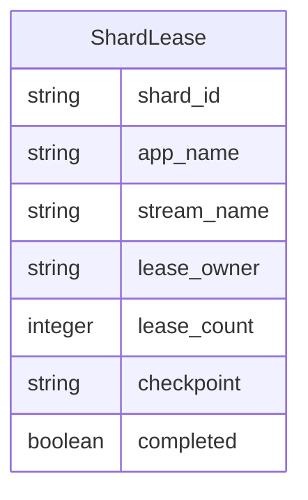
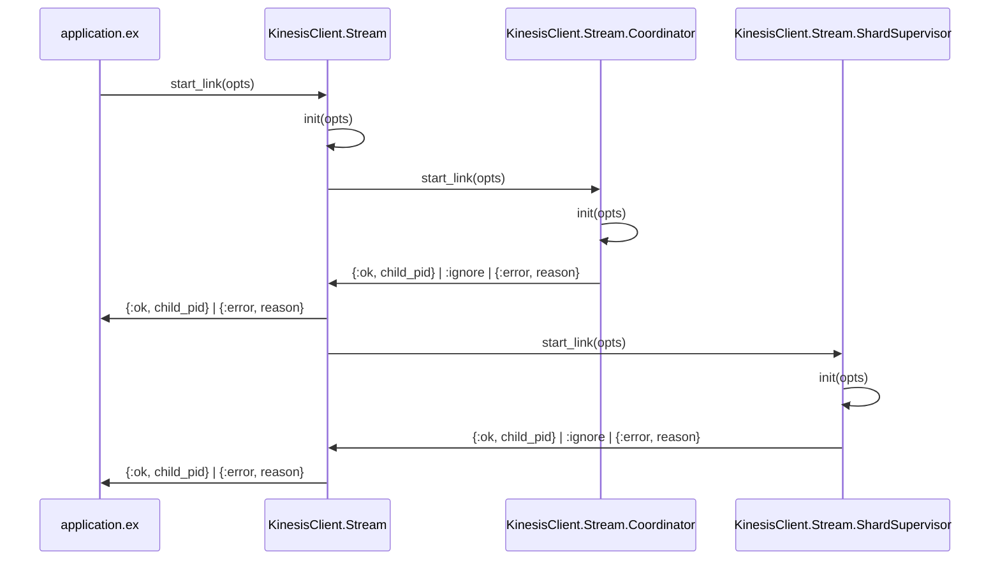
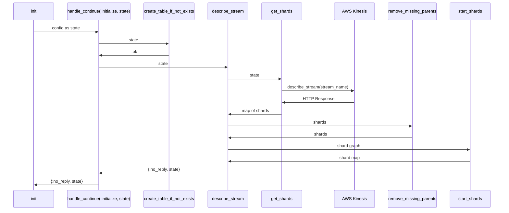
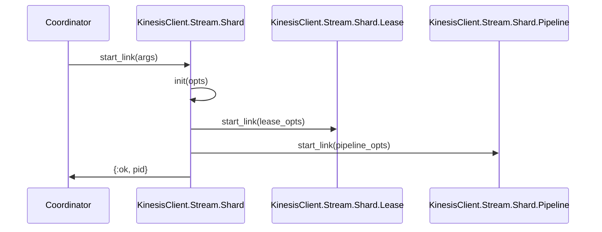
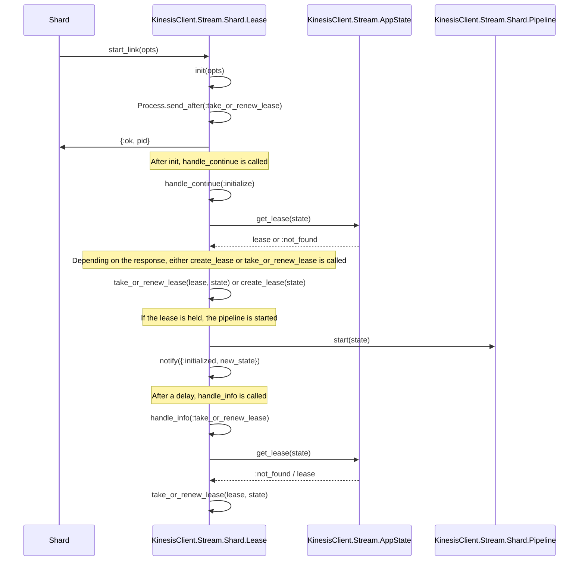

# Key Concepts

### Stream
A Kinesis Stream is composed of one or more shards. Each shard has the capacity to handle up to 1MB or 1000 records of data per second for writes, and up to 2MB per second for reads. The total capacity of a stream is the sum of the capacities of its shards.

Data records are stored in shards for a default of 24 hours, up to a maximum of 365 days. This allows applications to consume and process the data in near real-time, or retrieve the data from the stream later for further analysis.

### Shard
A shard in a Kinesis Stream is a fundamental unit of data storage and throughput. Each shard provides a fixed data capacity. Specifically, a shard can ingest up to 1MB or 1000 records of data per second for writes, and up to 2MB per second for reads.

Shards are used to parallelize data processing. The total capacity of a Kinesis Stream is the sum of the capacities of its shards. This means that you can increase the stream's capacity by adding more shards to the stream.

Each shard contains a sequence of data records, which are ordered by their arrival time. The data records are stored in shards for a default of 24 hours, up to a maximum of 365 days.

### Partition Key
In a Kinesis Stream, the Partition Key is a crucial component that determines how data is distributed across different shards. When a data record is added to the stream, it is associated with a Partition Key. This key is then hashed, and the resulting hash value determines which shard the record belongs to. This allows Kinesis to distribute data across multiple shards, enabling high throughput and concurrent processing.

Here's a brief overview of how the Partition Key is used:

1. **Data Distribution**: The Partition Key is used to segregate and aggregate data into shards. When a data record is put into the stream, it's associated with a Partition Key. This key is hashed, and the resulting hash value determines the shard for that data record.

2. **Ordering**: Within a shard, data records are ordered using the sequence number, which is unique for each record within a shard. However, the Partition Key also plays a role in maintaining order. All data records with the same partition key in a shard are guaranteed to be in the order they were put into the stream.

3. **Scaling**: The Partition Key plays a crucial role in scaling a Kinesis Stream. When a stream is scaled up or down, the Partition Key is used to distribute the data records among the new set of shards.

### Worker
A worker is a consumer application that reads data records from Kinesis Streams. Each worker is an independent process that pulls data from one or more shards in a Kinesis Stream.

Here's a brief overview of how a worker operates:

1. **Lease Acquisition**: When a worker starts up, it attempts to acquire a lease for a shard. If the lease for that shard is not currently held by another worker, the lease is granted, and the worker can start processing records from that shard.

2. **Data Processing**: Once a worker has a lease, it can start pulling data records from the shard and processing them. The specific processing logic depends on the application's requirements.

3. **Checkpointing**: As the worker processes data records, it periodically checkpoints its progress. This means it stores information about the last data record it processed in a durable location (like a database). This allows the worker to resume from where it left off in case of a failure.

4. **Lease Renewal**: While a worker is processing records, it periodically renews its lease to maintain ownership of the shard. If the lease renewal fails (perhaps because the worker has crashed or lost connectivity), the lease becomes available for other workers to acquire.

### Lease
A lease is a mechanism to ensure that only one worker is processing a shard at any given time. This is crucial to ensure that records in the shard are processed once and in the order they were received.

Also, a lease is a way to ensure that a worker can resume processing from where it left off in case of a failure or restart. By acquiring a lease, a worker can checkpoint its progress and renew the lease periodically to maintain ownership of the shard.

#### Shard Lease Table

### Checkpoint
A checkpoint is a mechanism used by a consumer (or worker) to keep track of the data records that have been processed in a shard.

When a worker processes a data record from a shard, it marks or 'checkpoints' that record. This checkpointing process involves storing the sequence number of the last data record processed by the worker. The sequence number is a unique identifier for each data record within a shard.

If a worker fails or restarts, it can use the checkpoint to know where to resume processing. Without checkpointing, the worker would have to start processing from the beginning of the shard, leading to duplicate processing.

---

---

# Kinesis Client Startup

The following is done when the application starts:
1. Stream is started
   - creates a name for the worker represented by this instance of the application (container) running the KinesisClinet
2. Coordinator is started
3. Shard Supervisor is started

## Application - Startup
When the application starts the Stream Supervisor is started.  The Stream Supervisor is responsible for starting/supervising the Coordinator and the Shard Supervisor.

## Coordinator - Startup
When the Coordinator starts it does the following:
1. Creates the shard lease table if it doesn't exist
2. Describes the stream
3. Waits for the stream to become active
4. Once active, builds a graph of the shards
5. Removes any shards that have missing parents
6. Starts all shards that meet any of the following criteria:
    - The shard has no parents and is not marked complete in the lease table
    - The shard has parents and all parents are marked complete in the lease table

## Shard - Startup
When a Shard starts it does the following:
1. Starts itself as a Supervisor that is supervised by the Shard Supervisor that was started by the Stream
2. Starts and supervises its children:
   - Lease
   - Pipeline

## Lease - Startup
When a Lease starts it does the following:
1. Starts a loop of trying to take or renew the lease by sending itself a delayed message
   - If the lease fails to renew, the Pipeline is stopped
2. Creates a row in the lease table if one does not exist
3. Attempts to take the lease
4. If the lease is taken, the Pipeline is started
   - whenever (within the loop) the lease is taken then the Pipeline is started

## Pipeline - Startup
When the pipeline starts then it starts a Broadway pipeline for its shard with `KinesisClient.Stream.Shard.Producer` as the producer.  The producer is given an initial status of `:stopped` so no records are read from kinesis until a lease is obtained.  Once the lease is obtained for this shard then `KinesisClient.Stream.Shard.Lease` will call start on the producer to update its status to `:started`.  

All Broadway calls are proxied to the configured shard consumer.

## Producer - Startup
The producer is started with the status of `:stopped` so no records are read from kinesis until a lease is obtained.  Once the lease is obtained for this shard then `KinesisClient.Stream.Shard.Lease` will call start on the producer to update its status to `:started`.  While it is stopped the producer "queues" (keeps record of) all demand from the consumer.

#### Producer Started
When the producer is started with `Producer.start` then it sends a message to itself that is handled by `handle_call(:start, from, state)` and does the following:
1. It gets the current checkpoint from the lease
2. Determines the starting position to begin reading from the shard 
   - If the checkpoint is empty then it starts reading from the beginning of the shard (TRIM_HORIZON)
   - If the checkpoint is not empty then it starts reading from the sequence number in the checkpoint
3. Gets a shard iterator from Kinesis
4. Reads records from the shard iterator
5. Emits records to the consumer (Broadway)

***Any records returned by `handle_demad`, `handle_info`, or `handle_call` are sent to the consumer (Broadway) for processing.***

---

---

# Reading Records
Records are read from the shard and sent to the consumer based on demand being requested from the Broadway by calling the producers `handle_demand` function.  Reading records from the shard follows the process below:
1. If the current state does NOT contain a shard iterator then get a shard iterator from Kinesis
2. Read records from the shard iterator
3. Handle excess demand
4. Update state with the next shard iterator and demand
5. Emit records to the consumer (Broadway)

### Demand
The consumer asks for records to process by sending a demand to the producer.  The producer then reads records from the shard and sends them to the consumer.

#### Excess Demand 
Whenever more demand is requested then can be fulfilled then a delayed message is sent to itself to get more records from the shard and emit them to the consumer.

### Acknowledgement
When the consumer has successfully processed the records then Broadway will send an acknowledgement to the producer.  The producer will then checkpoint the last record processed. In case this checkpoint includes the last record in the shard then the status of the shard is checked to see if it is closed.  If the shard is closed then the producer will start the process of closing the shard.

---

---

# Closing A Shard
The following happens when a shard is closed:
1. The complete field is set to true in the lease table
2. The Coordinator stops monitoring the shard's process
3. Stop is called on the shard's Supervisor, stopping all child processes

Below explains how this happens...

## Producer
Closing a shard starts in the Producer, below is the process:
1. An acknowledgment is received by the Producer from the Broadway consumer where all records were processed successfully and the shard status returned by kinesis during the last getRecords request is `closed` 
2. The producer begins a loop where it continually messages itself on a delay with the message of `:shard_closed`
3. Upon receiving the `:shard_closed` message, the producer sends a delayed message to itself to continue the loop 
4. Then producer updates the lease table by calling AppState.close_shard/5 to set complete = true for the shard
5. Finally, the producer calls close_shard/2 on the Coordinator

## Coordinator
Below is the process the coordinator follows to close a shard after being notified by the producer:
1. The coordinator casts a message to itself to close the shard
2. Upon receiving the message, the coordinator searches for the shard reference in the shard map
3. The shard process is demonitored by the coordinator
4. Shard.stop/1 is called

## Shard
Below is the process the shard follows to close itself after being notified by the coordinator:
1. Stop is called on the shard's Supervisor with the reason of `:normal`
2. The Supervisor stops all child processes (https://hexdocs.pm/elixir/1.16.0/Supervisor.html#module-start-and-shutdown)

---

---

