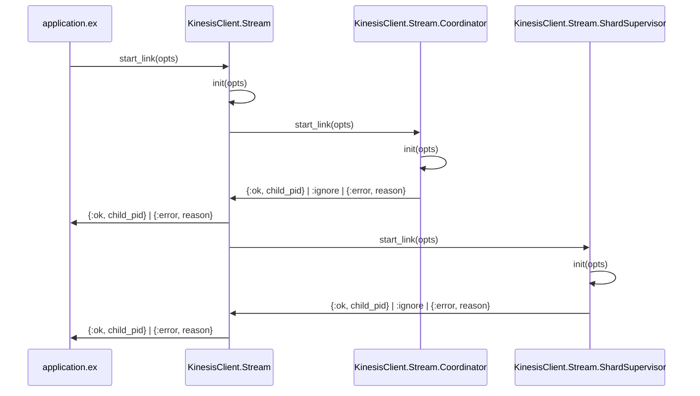
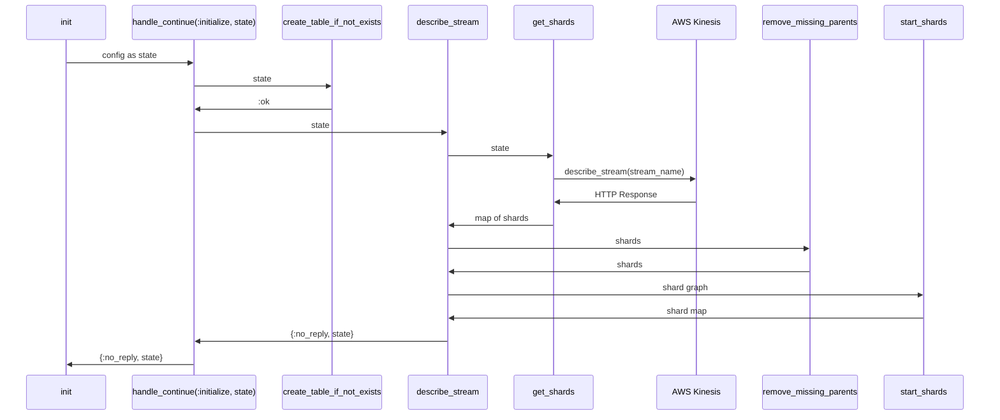

# Startup

## Application Start

```mermaid
sequenceDiagram
    application.ex ->> KinesisClient.Stream: start_link(opts)
    KinesisClient.Stream ->> KinesisClient.Stream: init(opts)
    KinesisClient.Stream ->> KinesisClient.Stream.Coordinator: start_link(opts) 
    KinesisClient.Stream.Coordinator ->> KinesisClient.Stream.Coordinator: init(opts)
    KinesisClient.Stream.Coordinator ->> KinesisClient.Stream: {:ok, child_pid} | :ignore | {:error, reason}
    KinesisClient.Stream ->> application.ex: {:ok, child_pid} | {:error, reason}
    KinesisClient.Stream ->> KinesisClient.Stream.ShardSupervisor: start_link(opts)
    KinesisClient.Stream.ShardSupervisor ->> KinesisClient.Stream.ShardSupervisor: init(opts)
    KinesisClient.Stream.ShardSupervisor ->> KinesisClient.Stream: {:ok, child_pid} | :ignore | {:error, reason}
    KinesisClient.Stream ->> application.ex: {:ok, child_pid} | {:error, reason}    
```

## Coordinator Start

```mermaid
sequenceDiagram
    participant  init as init
    participant handle_continue_init_state as handle_continue(:initialize, state)
    init ->> handle_continue_init_state: config as state
    handle_continue_init_state ->> create_table_if_not_exists: state
    create_table_if_not_exists ->> handle_continue_init_state: :ok
    handle_continue_init_state ->> describe_stream: state
    describe_stream ->> get_shards: state 
    get_shards ->> AWS Kinesis: describe_stream(stream_name)
    AWS Kinesis ->> get_shards: HTTP Response
    get_shards ->> describe_stream: map of shards
    describe_stream ->> remove_missing_parents: shards
    remove_missing_parents ->> describe_stream: shards
    describe_stream ->> start_shards: shard graph
    start_shards ->> describe_stream: shard map
    describe_stream ->> handle_continue_init_state: {:no_reply, state}
    handle_continue_init_state ->> init: {:no_reply, state}
```

## Start Shards
TODO

## Shard Start
TODO

## TODO - The Rest...